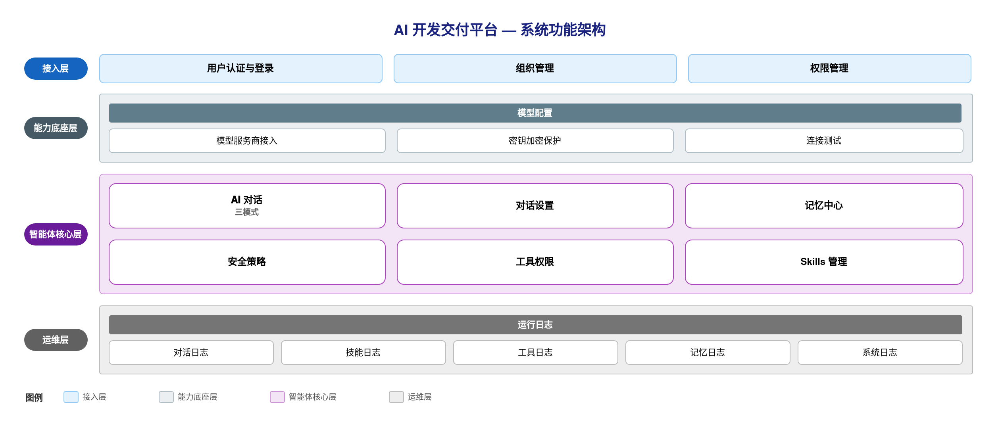

# SRS需求规格说明书 · AI 开发交付平台

## 一、文档信息

| 项目名称 | AI 开发交付平台 |
|---------|-----------|
| 文档版本 | V1.0 |
| 编制日期 | 2026-07-11 |
| 编制人 | [待定] |
| 审核人 | - |
| 批准人 | - |
| 客户单位 | [待定客户单位] |
| 编制单位 | [待定编制单位] |
| 适用范围 | 本平台的产品团队、研发团队、测试团队及运维团队，作为需求确认、设计开发、测试验收的统一依据 |
| 核心目标 | 建设一套以规格驱动、智能体编排为核心的 AI 开发交付平台，覆盖模型配置、智能体对话、记忆、安全、工具、技能的统一治理 |
| 文档状态 | 草稿 |

**历史版本**

| 版本 | 日期 | 作者 | 更改说明 |
|-----|------|------|---------|
| V1.0 | 2026-07-11 | [待定] | 初始版本，覆盖全平台 11 个功能模块 |

---

## 二、项目概述

### 2.1 项目背景

随着大语言模型在企业场景的深入应用，团队在将 AI 智能体接入实际业务时面临以下挑战：

1. **模型接入分散、密钥管理无序**：不同业务各自对接模型服务商，接入方式不统一，密钥、地址等敏感配置缺乏集中管理与保护，存在泄露和滥用风险。
2. **智能体行为缺乏统一治理**：智能体可执行命令、访问数据、调用工具，但危险操作、敏感内容、高风险指令缺乏统一的风险分级与审批机制，行为边界不清晰。
3. **长期记忆难以沉淀与管控**：智能体的身份设定、用户偏好、项目上下文缺乏结构化的长期记忆载体，记忆写入无版本留痕、无确认机制，难以追溯和回滚。
4. **工具与技能能力无序扩张**：智能体可调用的工具和技能不断增加，缺乏权限分级、调用留痕与统一编排，能力开放范围难以把控。
5. **交付过程缺乏规格约束**：从需求到交付缺少统一的规格驱动流程，人工经验依赖度高，质量与一致性难以保障。

为解决上述问题，建设 AI 开发交付平台，实现模型、对话、记忆、安全、工具、技能的统一接入与治理，提升 AI 能力交付的规范性、安全性与可追溯性。

### 2.2 项目建设目标

本项目旨在建设一套以规格驱动、智能体编排为核心的 AI 开发交付平台，实现以下目标：

1. **统一模型接入与保护**：集中管理模型服务商与模型配置，密钥加密存储、按需解密取用，接入地址经安全校验，杜绝敏感配置随请求传输，为全平台智能体能力提供统一、安全的模型底座。
2. **构建可治理的智能体对话能力**：提供支持多种交互形态的 AI 对话，对话运行时自动注入长期记忆与系统上下文，让智能体在统一约束下作答，并将对话、技能、工具的运行情况纳入统一日志。
3. **建立长期记忆管控体系**：以结构化记忆文件承载智能体身份、用户偏好与项目上下文，记忆写入全程经安全策略统一治理与版本留痕，支持人工确认、审批、版本回滚，保障记忆可追溯、可回退。
4. **实现智能体行为的安全治理**：对命令、数据、工具、记忆等操作按风险等级统一校验，支持敏感内容拦截、黑白名单、人工确认与审批工单流转，高风险操作留存脱敏审计，确保智能体行为在可控边界内。
5. **规范工具与技能的能力开放**：对智能体可调用的工具与可执行的技能进行统一登记、权限分级、版本管理与调用留痕，让能力开放范围清晰可控、运行情况可审计。

### 2.3 项目建设范围

本项目建设范围包括：

**系统端**：

- PC 端管理平台（Web 应用），面向平台管理与智能体治理

**功能模块**：

- 用户认证与登录：账号登录、图形验证码校验、身份鉴权
- 组织管理：部门、岗位、用户的统一维护
- 权限管理：角色、菜单与功能权限的分配
- 模型配置：模型服务商与模型的接入、密钥保护、连接测试
- AI 对话：支持多种交互形态的智能体对话与会话历史
- 对话设置：对话参数与系统提示词的个性化配置
- 记忆中心：长期记忆文件管理、版本回滚、待确认记忆、模型建议、安全治理与命中率统计
- 安全策略：风险等级、敏感词、黑白名单、审批工单的统一治理
- 工具权限：智能体可调用工具的登记、权限分级与调用留痕
- Skills 管理：技能的登记、版本管理、执行前安全校验与运行留痕
- 运行日志：对话、技能、工具、记忆、系统等多源运行情况的统一查询

**数据范围**：

- 组织与权限数据：部门、岗位、用户、角色、菜单
- 模型接入数据：服务商配置、模型配置
- 智能体治理数据：记忆文件及版本、安全策略与审批工单、工具与调用日志、技能与运行日志、运行日志

**不包含的功能**：

- 移动端应用：本期以 PC 端管理平台为主，移动端后续迭代实现
- 模型自身的训练与微调：平台仅负责接入与治理，不涉及模型训练

### 2.4 业务流程图

> 【待补业务流程图】本图将展示平台核心业务主流程：用户登录 → 选择模型 → 发起智能体对话 → 运行时注入长期记忆与系统上下文 → 记忆写入经安全策略统一裁决（拒绝／需确认／需审批／放行）→ 调用工具或执行技能（经权限与安全校验）→ 记录运行日志。图片将输出至 `images/business-flow.png`。

### 2.5 业务角色定义

| 角色名称 | 角色描述 | 主要职责 | 权限范围 |
|---------|---------|---------|---------|
| 系统管理员 | 负责平台基础配置与运行维护 | 组织管理、权限分配、模型配置、平台运行监控 | 全部功能 |
| 智能体运营配置员 | 负责智能体能力的配置与治理 | 记忆管理、安全策略配置、工具权限管理、技能管理、对话设置 | 智能体治理相关功能 |
| 终端使用者 | 日常使用智能体能力的业务人员 | 发起 AI 对话、查看运行日志 | 对话与查询类功能 |

---

## 三、项目建设内容

### 3.1 总体功能架构

平台按职责分为四层，自上而下依赖：

- **接入层**：用户认证与登录、组织管理、权限管理，负责身份鉴权与账号权限的统一维护。
- **能力底座层**：模型配置，为全平台智能体能力提供统一、安全的模型接入底座。
- **智能体核心层**：AI 对话、对话设置、记忆中心、安全策略、工具权限、Skills 管理，是平台的核心业务域，覆盖智能体的对话、记忆、安全治理、工具与技能能力。
- **运维层**：运行日志，对对话、技能、工具、记忆、系统等多源运行情况进行统一查询。

**PC 端（管理平台）菜单结构：**

- 用户认证与登录（一级菜单）
- 组织管理（一级菜单）
  - 部门管理（二级菜单）
  - 岗位管理（二级菜单）
  - 用户管理（二级菜单）
- 权限管理（一级菜单）
  - 角色管理（二级菜单）
  - 菜单管理（二级菜单）
- 模型配置（一级菜单）
- 智能体工作台（一级菜单）
  - AI 对话（二级菜单）
  - 对话设置（二级菜单）
  - 记忆中心（二级菜单）
  - 安全策略（二级菜单）
  - 工具权限（二级菜单）
  - Skills 管理（二级菜单）
  - 运行日志（二级菜单）

### 3.2 需求功能清单

| 序号 | 业务需求 | 需求概述 | 优先级 |
|-----|---------|---------|-------|
| 1 | 用户身份认证 | 用户通过账号密码登录，登录需图形验证码校验，不同角色拥有不同功能权限 | P0 |
| 2 | 组织架构管理 | 统一维护部门、岗位、用户，支持层级组织与用户归属管理 | P0 |
| 3 | 权限分配管理 | 通过角色关联菜单与功能权限，实现按角色的功能可见与可操作控制 | P0 |
| 4 | 模型统一接入 | 集中接入模型服务商与模型，密钥加密存储、按需解密，支持连接测试 | P0 |
| 5 | 智能体对话 | 提供支持多种交互形态的 AI 对话，运行时注入长期记忆与系统上下文 | P0 |
| 6 | 对话个性化设置 | 支持配置对话参数与系统提示词，个性化约束智能体作答 | P1 |
| 7 | 长期记忆管理 | 以记忆文件承载智能体身份、用户偏好与项目上下文，支持版本留痕与回滚 | P0 |
| 8 | 记忆写入治理 | 记忆写入前经安全策略统一裁决，支持人工确认、审批与敏感内容拦截 | P0 |
| 9 | 待确认记忆与模型建议 | 对智能体产生的待确认记忆与改进建议进行确认、应用或忽略 | P1 |
| 10 | 安全策略治理 | 对命令、数据、工具、记忆等操作按风险等级统一校验，支持敏感词与黑白名单 | P0 |
| 11 | 审批工单流转 | 高风险操作生成审批工单，支持审批通过或驳回，留存脱敏审计 | P0 |
| 12 | 工具权限管理 | 对智能体可调用工具进行登记、权限分级与调用留痕 | P1 |
| 13 | 技能管理 | 对技能进行登记、版本管理、执行前安全校验与运行留痕 | P1 |
| 14 | 运行情况追溯 | 对对话、技能、工具、记忆、系统等多源运行情况进行统一查询 | P1 |

### 3.3 页面功能清单

| 终端 | 一级菜单 | 二级菜单 | 子功能 | 功能描述 |
|-----|---------|---------|-------|---------|
| PC端 | 用户认证与登录 | - | 登录 | 输入账号密码并通过图形验证码校验后登录 |
| ^ | ^ | - | 获取验证码 | 获取并刷新图形验证码 |
| ^ | 组织管理 | 部门管理 | 列表 | 按层级展示部门，支持查询 |
| ^ | ^ | ^ | 新增 | 新增部门并指定上级部门 |
| ^ | ^ | ^ | 编辑 | 修改部门信息 |
| ^ | ^ | ^ | 删除 | 删除部门 |
| ^ | ^ | 岗位管理 | 列表 | 分页展示岗位，支持按状态筛选 |
| ^ | ^ | ^ | 新增 | 新增岗位 |
| ^ | ^ | ^ | 编辑 | 修改岗位信息 |
| ^ | ^ | ^ | 删除 | 删除岗位 |
| ^ | ^ | 用户管理 | 列表 | 分页展示用户，支持按部门、状态筛选 |
| ^ | ^ | ^ | 新增 | 新增用户并分配部门、角色 |
| ^ | ^ | ^ | 编辑 | 修改用户信息与角色 |
| ^ | ^ | ^ | 删除 | 删除用户 |
| ^ | 权限管理 | 角色管理 | 列表 | 分页展示角色 |
| ^ | ^ | ^ | 新增 | 新增角色 |
| ^ | ^ | ^ | 编辑 | 修改角色信息 |
| ^ | ^ | ^ | 分配菜单 | 为角色分配可访问菜单与功能权限 |
| ^ | ^ | ^ | 删除 | 删除角色 |
| ^ | ^ | 菜单管理 | 列表 | 按层级展示菜单 |
| ^ | ^ | ^ | 新增 | 新增菜单并配置权限标识 |
| ^ | ^ | ^ | 编辑 | 修改菜单信息 |
| ^ | ^ | ^ | 显示切换 | 切换菜单显示或隐藏 |
| ^ | ^ | ^ | 删除 | 删除菜单 |
| ^ | 模型配置 | - | 服务商列表 | 分页展示模型服务商配置 |
| ^ | ^ | - | 新增服务商 | 新增服务商并填写接入地址与密钥 |
| ^ | ^ | - | 编辑服务商 | 修改服务商配置 |
| ^ | ^ | - | 查看密钥 | 按需查看已保存的密钥 |
| ^ | ^ | - | 连接测试 | 测试服务商与模型连接可用性 |
| ^ | ^ | - | 模型列表 | 展示服务商下的模型配置 |
| ^ | ^ | - | 新增模型 | 新增模型配置 |
| ^ | ^ | - | 删除 | 删除服务商或模型 |
| ^ | 智能体工作台 | AI 对话 | 发起对话 | 选择模型后发起智能体对话并接收回复 |
| ^ | ^ | ^ | 切换模式 | 在多种对话交互形态间切换 |
| ^ | ^ | ^ | 会话历史 | 查看、切换与删除历史会话 |
| ^ | ^ | 对话设置 | 参数设置 | 配置对话参数 |
| ^ | ^ | ^ | 系统提示词 | 配置对话的系统提示词 |
| ^ | ^ | 记忆中心 | 列表 | 展示记忆文件及统计概览 |
| ^ | ^ | ^ | 详情查看 | 查看记忆文件内容、版本与建议 |
| ^ | ^ | ^ | 新增 | 新增记忆文件 |
| ^ | ^ | ^ | 编辑保存 | 编辑记忆内容并保存 |
| ^ | ^ | ^ | 权限设置 | 设置记忆文件的读取、自动写入、确认等权限 |
| ^ | ^ | ^ | 启用停用 | 启用或停用记忆文件 |
| ^ | ^ | ^ | 版本回滚 | 查看版本历史并回滚到指定版本 |
| ^ | ^ | ^ | 待确认处理 | 确认或忽略待确认记忆 |
| ^ | ^ | ^ | 建议处理 | 应用或忽略模型建议 |
| ^ | ^ | ^ | 删除 | 删除记忆文件 |
| ^ | ^ | 安全策略 | 风险等级配置 | 配置各风险等级的默认处理方式 |
| ^ | ^ | ^ | 敏感词管理 | 维护敏感词规则 |
| ^ | ^ | ^ | 黑白名单管理 | 维护命令、目录、接口等黑白名单 |
| ^ | ^ | ^ | 审批工单处理 | 查看并审批或驳回工单 |
| ^ | ^ | ^ | 审计日志查看 | 查看脱敏后的安全审计记录 |
| ^ | ^ | 工具权限 | 列表 | 展示可调用工具及权限配置 |
| ^ | ^ | ^ | 权限设置 | 设置工具的调用权限与风险等级 |
| ^ | ^ | ^ | 启用停用 | 启用或停用工具 |
| ^ | ^ | ^ | 调用日志 | 查看工具调用留痕 |
| ^ | ^ | Skills 管理 | 列表 | 展示技能及状态 |
| ^ | ^ | ^ | 新增 | 新增技能 |
| ^ | ^ | ^ | 编辑保存 | 编辑技能内容并保存 |
| ^ | ^ | ^ | 版本管理 | 查看技能版本历史 |
| ^ | ^ | ^ | 启用停用 | 启用或停用技能 |
| ^ | ^ | ^ | 运行日志 | 查看技能运行留痕 |
| ^ | ^ | 运行日志 | 列表 | 按类型、时间查询多源运行日志 |
| ^ | ^ | ^ | 详情查看 | 查看单条运行日志详情 |

### 3.4 页面访问权限

| 功能模块 | 系统管理员 | 智能体运营配置员 | 终端使用者 |
|---------|-----------|----------------|-----------|
| 组织管理 | 全部权限 | 无 | 无 |
| 权限管理 | 全部权限 | 无 | 无 |
| 模型配置 | 全部权限 | 查看 | 无 |
| AI 对话 | 全部权限 | 全部权限 | 全部权限 |
| 对话设置 | 全部权限 | 全部权限 | 查看 |
| 记忆中心 | 全部权限 | 全部权限 | 无 |
| 安全策略 | 全部权限 | 全部权限 | 无 |
| 工具权限 | 全部权限 | 全部权限 | 无 |
| Skills 管理 | 全部权限 | 全部权限 | 无 |
| 运行日志 | 全部权限 | 查看 | 查看 |

### 3.5 功能详细设计

### 3.5.1 用户认证与登录

**（一）功能需求概述**

用户认证与登录功能用于核验用户身份并建立登录状态，登录成功后系统按用户所属角色加载其可见的菜单与操作权限，为后续所有功能模块的访问控制提供基础。未通过身份核验或登录状态失效时，系统统一拦截并引导用户重新登录。

**（二）功能设计**

**账号密码登录**

用户在登录页填写账号和密码完成身份核验。

| 字段名称 | 类型 | 必填 | 默认值 | 说明 |
|---------|------|------|-------|------|
| 账号 | 文本输入 | 是 | - | 未填写时提示"请输入账号" |
| 密码 | 密码输入 | 是 | - | 未填写时提示"请输入密码" |
| 记住密码 | 勾选 | 否 | 勾选 | - |

登录成功：提示登录成功，并跳转至首页。
登录失败：保留已填写的账号，清空密码，显示具体错误原因。

**图形验证码（规划中）**

系统规划支持登录图形验证码校验，用户需正确填写验证码方可完成登录，用于防止账号被暴力破解。该能力尚在建设中，当前登录流程暂不包含验证码校验环节。

**登录后处理**

登录成功后，系统自动获取当前账号的个人信息，并根据该账号所属角色加载其可见的菜单与可执行的操作权限，作为本次登录状态下访问控制的依据。

**访问拦截**

- 未登录状态下访问需要登录才能查看的页面，系统强制跳转至登录页。
- 已登录状态下访问登录页，系统自动跳转至首页，无需重复登录。

**退出登录**

点击"退出登录"，系统清除本地保存的登录信息，并通知后端使当前访问凭证及刷新凭证立即失效，跳转至登录页。

**业务规则**

- 账号不存在或密码错误时，统一提示"用户名或密码错误"，不区分具体原因。
- 账号处于禁用状态时，登录被拒绝，提示"用户已被禁用"。
- 登录成功后签发访问凭证（默认有效期 2 小时）和刷新凭证（默认有效期 15 天），用于维持登录状态。
- 修改密码后，该账号此前签发的所有访问凭证立即失效，需要重新登录。
- 同一账号重复登录时，最新登录签发的凭证覆盖此前的登录状态，此前登录的设备需重新登录。
- 访问凭证或刷新凭证失效时，系统拦截当前操作，跳转至登录页要求重新登录。
- 账号为超级管理员时，放行全部功能的访问和操作权限；其余账号按所属角色配置的权限标识逐项比对。
- 可见菜单按账号所属角色过滤，仅展示该角色有权限访问的菜单。
- 账号登录后无任何可访问菜单时，引导至无权限提示页面。

**边界与异常**

- **账号或密码错误**：提示"用户名或密码错误"。
- **账号被禁用**：提示"用户已被禁用"。
- **登录状态失效**：访问受限页面或执行需登录的操作时，若访问凭证已失效，强制跳转至登录页。
- **无可访问菜单**：登录成功但当前角色未配置任何可见菜单时，引导至无权限提示页面。
- **已登录无权限**：已登录状态下尝试访问未被授权的功能页面时，系统拦截访问，跳转至无权限提示页面。

**（三）业务逻辑关联**

- 登录后可见的菜单结构与操作权限标识，来源于权限管理中该账号所属角色配置的角色与菜单权限。
- 账号状态（启用/禁用）及密码信息，来源于组织管理的用户管理中维护的账号数据；账号被禁用或密码变更后，直接影响本功能的登录核验结果。
- 图形验证码能力建设后，将作为登录核验流程的前置校验环节，与账号密码校验共同构成完整的登录身份核验链路。

### 3.5.2 组织管理

**（一）功能需求概述**

组织管理维护企业的部门层级、岗位定义和用户账号，是权限分配、身份认证等模块的基础数据来源。部门树决定用户的组织归属，岗位与角色描述用户的职务与操作权限。本模块包含部门管理、岗位管理、用户管理三个子功能。

**（二）功能设计**

#### 3.5.2.1 部门管理

**查询/筛选功能**

| 筛选字段 | 类型 | 说明 |
|---------|------|------|
| 部门名称 | 文本输入 | 支持模糊搜索，可清空 |

**列表功能**

以层级树形式展示部门结构，按层级缩进展示父子关系：

| 列名 | 字段类型 | 说明 |
|-----|---------|------|
| 部门名称 | 文本 | 树形展示，含子部门缩进 |
| 类型 | 文本 | 省公司 / 分公司 / 部门 |
| 负责人 | 文本 | 无值显示"-" |
| 排序 | 数字 | 同级按该值升序排列 |
| 更新时间 | 日期时间 | 每次编辑后更新 |
| 操作 | 操作按钮 | 新增子部门、编辑、删除 |

**新增功能**

点击"新增"，或在某部门节点下点击"新增子部门"，弹出编辑窗口。通过"新增子部门"入口新增时，上级部门自动带入当前节点。

| 字段名称 | 类型 | 必填 | 默认值 | 说明 |
|---------|------|------|-------|------|
| 部门名称 | 文本输入 | 是 | - | - |
| 上级部门 | 层级选择 | 否 | 无（顶级） | 来源于已有部门树；编辑时排除自身及其所有子部门 |
| 部门类型 | 单选 | 是 | - | 枚举值：省公司 / 分公司 / 部门 |
| 负责人 | 文本输入 | 否 | - | - |
| 联系电话 | 文本输入 | 否 | - | - |
| 排序 | 数字输入 | 否 | 0 | 用于控制树内展示顺序 |

**编辑功能**

点击"编辑"，弹出编辑窗口，自动填入当前部门数据，表单字段同新增。

**删除功能**

点击"删除"，弹出确认"确定要删除部门"{名称}"吗？"。删除有关联用户的部门时被拒绝，提示"关联数据不存在或被引用"。

**业务规则**

- 编辑部门时，上级部门可选范围自动排除该部门自身及其所有下级部门，防止形成循环层级。
- 删除有关联用户的部门被拒绝，需先解除用户与该部门的归属关系。

#### 3.5.2.2 岗位管理

**查询/筛选功能**

| 筛选字段 | 类型 | 说明 |
|---------|------|------|
| 岗位名称 | 文本输入 | 支持模糊搜索，可清空 |

**列表功能**

| 列名 | 字段类型 | 说明 |
|-----|---------|------|
| 岗位名称 | 文本 | - |
| 岗位描述 | 文本 | 内容较长时悬停显示完整内容 |
| 排序 | 数字 | - |
| 创建时间 | 日期时间 | - |

**新增/编辑功能**

| 字段名称 | 类型 | 长度限制 | 必填 | 默认值 | 说明 |
|---------|------|---------|------|-------|------|
| 岗位名称 | 文本输入 | 最多 50 字 | 是 | - | - |
| 岗位描述 | 多行文本 | 最多 200 字 | 否 | - | - |
| 排序 | 数字输入 | 0-9999 | 否 | 0 | - |

**删除功能**

点击"删除"，弹出确认"确定要删除岗位"{名称}"吗？"。删除有关联用户的岗位被拒绝。

#### 3.5.2.3 用户管理

**部门树筛选**

页面左侧展示部门层级树，含"全部"根节点，提供名称搜索，点击任一部门节点后右侧用户列表按该部门筛选；点击"全部"节点则不按部门筛选。

**查询/筛选功能**

| 筛选字段 | 类型 | 说明 |
|---------|------|------|
| 员工查询 | 文本输入 | 支持按姓名、账号、手机号模糊匹配，可清空 |
| 员工状态 | 单选 | 枚举值：启用 / 禁用，可清空 |

**列表功能**

| 列名 | 字段类型 | 说明 |
|-----|---------|------|
| 姓名 | 文本 | - |
| 账号 | 文本 | 编辑时不可修改 |
| 所属部门 | 文本 | 无值显示"-" |
| 岗位 | 文本 | 无值显示"-" |
| 角色 | 文本 | 多个角色以逗号连接展示，无值显示"-" |
| 手机号 | 文本 | 中间位数隐藏展示 |
| 状态 | 状态切换 | 启用 / 禁用，可在列表直接切换，切换后立即生效，失败时自动还原 |
| 操作 | 操作按钮 | 编辑、删除 |

列表支持勾选多行，用于批量删除。

**新增功能**

点击"新增用户"，弹出编辑窗口。

| 字段名称 | 类型 | 长度限制 | 必填 | 默认值 | 说明 |
|---------|------|---------|------|-------|------|
| 姓名 | 文本输入 | 最多 20 字 | 是 | - | - |
| 账号 | 文本输入 | - | 是 | - | - |
| 密码 | 密码输入 | - | 是 | - | 仅新增时填写 |
| 手机号 | 文本输入 | 最多 11 字 | 否 | - | - |
| 所属部门 | 层级选择 | - | 是 | - | 来源于组织管理的部门树 |
| 岗位 | 单选 | - | 否 | - | 来源于岗位管理的岗位 |
| 角色 | 多选 | - | 否 | - | 来源于权限管理的角色 |
| 邮箱 | 文本输入 | - | 否 | - | 填写时校验邮箱格式，留空不校验 |

**编辑功能**

点击"编辑"，弹出编辑窗口，自动填入当前用户数据。编辑表单不含密码字段，账号字段不可修改，其余字段同新增。

**删除功能**

点击"删除"或勾选多条后"批量删除"，弹出确认。超级管理员账号禁止删除，单条删除与批量删除均先校验，命中则整体拒绝。

**业务规则**

- 超级管理员账号（账号为 admin）禁止删除。
- 用户列表状态开关直接切换启用/禁用，切换后立即生效，保存失败时开关状态自动还原。
- 岗位、角色下拉选项不区分启用状态，禁用状态的岗位/角色仍会出现在可选列表中。
- 邮箱字段仅在填写非空值时校验格式。

**（三）业务逻辑关联**

- 用户的所属部门来源于部门管理维护的部门树。
- 用户的岗位来源于岗位管理维护的岗位数据。
- 用户的角色来源于权限管理维护的角色数据；用户被删除时其角色关联一并清除。
- 部门、岗位被用户引用时不可删除，保障基础数据的引用完整性。

### 3.5.3 权限管理

**（一）功能需求概述**

权限管理定义系统角色及各角色可访问的菜单与可执行的操作，通过角色与菜单的关联关系，控制用户登录后可见的菜单入口和可执行的按钮级操作。菜单管理同时维护系统导航结构本身的显示与隐藏，为角色分配权限提供可勾选的菜单及功能点范围。本模块包含角色管理、菜单管理两个子功能。

**（二）功能设计**

#### 3.5.3.1 角色管理

**查询/筛选功能**

| 筛选字段 | 类型 | 说明 |
|---------|------|------|
| 角色名称 | 文本输入 | 支持模糊搜索 |
| 角色状态 | 单选 | 枚举值：启用 / 禁用 |

**列表功能**

| 列名 | 字段类型 | 说明 |
|-----|---------|------|
| ID | 数字 | 系统自动生成，全局唯一 |
| 名称 | 文本 | - |
| 标识 | 文本 | 英文标识，全局唯一 |
| 备注 | 文本 | 内容较长时悬停显示完整内容，无值显示"-" |
| 创建时间 | 日期时间 | - |
| 操作 | 操作按钮 | 编辑、删除、分配权限 |

**新增/编辑功能**

| 字段名称 | 类型 | 必填 | 默认值 | 说明 |
|---------|------|------|-------|------|
| 角色标识 | 文本输入 | 是 | - | 英文标识，全局唯一，用于系统内部识别角色 |
| 角色名称 | 文本输入 | 是 | - | - |
| 备注 | 多行文本 | 否 | - | - |
| 状态 | 单选 | 是 | 启用 | 枚举值：启用 / 禁用 |

**分配权限功能**

点击"分配权限"，进入该角色的权限配置，以层级方式展示系统全部菜单及功能点，支持逐级勾选，父级与子级勾选状态联动。保存时系统清空该角色原有的菜单权限关联，按当前勾选结果整体重新写入，即每次保存均为全量覆盖，不支持增量追加。

**删除功能**

点击"删除"，弹出确认。删除后该角色在所有已分配用户上的角色关联一并移除，相关用户不再拥有该角色对应的菜单与操作权限。

**业务规则**

- 角色标识在系统内全局唯一。新增/编辑时若标识重复，阻止提交，提示"数据已存在（唯一约束冲突）"。
- 角色状态默认启用，仅可在新增或编辑表单内设置，列表未提供独立的状态切换入口。
- 分配权限保存为全量覆盖，不支持增量追加。
- 角色删除后，其在所有用户的角色关联一并移除。

#### 3.5.3.2 菜单管理

**查询/筛选功能**

| 筛选字段 | 类型 | 说明 |
|---------|------|------|
| 菜单名称 | 文本输入 | 在已加载的菜单树中过滤 |
| 菜单类型 | 单选 | 枚举值：目录 / 菜单 / 按钮 |

**列表功能**

以层级树形式展示系统全部菜单结构：

| 列名 | 字段类型 | 说明 |
|-----|---------|------|
| 菜单名称 | 文本 | 按层级缩进展示 |
| 类型 | 文本 | 目录 / 菜单 / 按钮 |
| 图标 | 图标 | 无值不展示 |
| 权限标识 | 文本 | 无值显示"-" |
| 排序 | 数字 | 同级菜单按该值升序排列 |
| 更新时间 | 日期时间 | - |
| 是否显示 | 状态切换 | 显示 / 隐藏，点击可直接切换 |
| 操作 | 操作按钮 | 新增子级、编辑、删除 |

**新增/编辑功能**

点击"新增"，或在某菜单节点下点击"新增子级"，弹出编辑窗口。通过"新增子级"入口新增时，上级菜单自动带入当前节点。

| 字段名称 | 类型 | 长度限制 | 必填 | 默认值 | 说明 |
|---------|------|---------|------|-------|------|
| 菜单类型 | 单选 | - | 是 | - | 枚举值：目录 / 菜单 / 按钮 |
| 菜单名称 | 文本输入 | - | 是 | - | - |
| 上级菜单 | 层级选择 | - | 否 | - | 来源于已有的目录、菜单类型节点，不含按钮类型 |
| 访问路径 | 文本输入 | - | 否 | - | 菜单类型为目录或菜单时显示 |
| 页面标识 | 文本输入 | - | 否 | - | 菜单类型为菜单时显示 |
| 菜单图标 | 图标选择 | - | 否 | - | 菜单类型为目录或菜单时显示 |
| 权限标识 | 文本输入 | - | 否 | - | 各菜单类型均可填写，用于标识按钮级操作权限 |
| 排序 | 数字输入 | 0-9999 | 否 | 0 | 数值越小越靠前 |
| 是否显示 | 单选 | - | 是 | 显示 | 枚举值：显示 / 隐藏 |
| 保留页面状态 | 单选 | - | 否 | 是 | 菜单类型时显示，枚举值：是 / 否 |

**删除功能**

点击"删除"，弹出确认。删除后所有已勾选该菜单的角色，其权限配置中对应的勾选一并移除。

**业务规则**

- 上级菜单可选范围仅为目录、菜单类型节点，不包含按钮类型节点。
- 访问路径、页面标识、菜单图标、保留页面状态等字段按所选菜单类型条件显示。
- 菜单删除后，所有已勾选该菜单的角色，其权限配置中对应的勾选关联一并移除。
- 是否显示仅控制该菜单在导航结构中的展示与隐藏，不影响其权限标识被分配给角色。
- 菜单仅具备"显示/隐藏"状态，不具备独立的"启用/停用"状态。

**（三）业务逻辑关联**

- 角色管理中分配权限所展示的菜单及功能点范围，来源于菜单管理维护的菜单树结构。
- 组织管理中用户的角色分配，依赖角色管理中已创建的角色数据。
- 菜单管理中删除某菜单后，所有已分配该菜单权限的角色，其权限配置一并同步移除对应勾选。

### 3.5.4 模型配置

**（一）功能需求概述**

模型配置为智能体对话接入不同的大模型服务，录入服务商的接入地址与密钥，并维护可用模型。密钥在系统内加密保存、仅在用户主动查看时按需展示，接入地址经安全校验防止指向内网，保障密钥不被明文泄露、地址不被滥用。对话时从已启用的模型中选择使用。

**（二）功能设计**

**模型列表**

以卡片形式跨服务商合并展示已配置模型：

| 展示信息 | 说明 |
|---------|------|
| 模型名称 | 用户自定义的模型展示名 |
| 主用模型标记 | 当前对话选中的模型显示标记 |
| 所属服务商名称 | 该模型所挂载服务商连接的名称 |
| 启用状态 | 显示"启用中"或"未启用" |
| 模型标识 | 服务商侧的模型标识 |

列表为空时提示"暂无模型，点击「添加模型」创建"。

**新增/编辑模型**

点击"添加模型"弹出编辑窗口。新增模型时，系统根据填写的接入地址自动创建一条服务商连接，服务商类型与协议类型由地址自动推断。

| 字段名称 | 类型 | 取值范围 | 必填 | 默认值 | 说明 |
|---------|------|---------|------|-------|------|
| 模型名称 | 文本输入 | ≤100 字符 | 是 | - | 模型展示名称 |
| 模型标识 | 文本输入 | ≤100 字符，禁止含空格 | 是 | - | 服务商侧真实模型标识 |
| 模型池分组 | 选择（可自由输入） | ≤50 字符 | 否 | - | 候选：通用大模型/代码模型/视觉模型/向量模型/多模态模型 |
| API Key | 密码输入 | ≤500 字符 | 否 | - | 已配置时留空表示不修改；可按需查看明文 |
| API 地址 | 文本输入 | ≤500 字符，须为合法 http/https 地址 | 是 | - | 决定服务商类型与协议类型的自动推断 |
| 最大上下文长度 | 数字输入 | ≥1 | 否 | 128000 | 上下文窗口 Token 数 |
| 默认温度 | 数字输入 | 0-2 | 否 | 0.7 | 留空则调用时不下发，走模型默认 |
| 默认 Top P | 数字输入 | 0-1 | 否 | 1 | 留空则不下发 |
| 是否启用 | 开关 | - | 否 | 启用 | 影响是否出现在对话模型选择列表 |
| 对话能力 | 勾选 | - | 否 | 勾选 | 支持自然语言对话与问答 |
| 代码生成 | 勾选 | - | 否 | 勾选 | 支持代码生成与补全 |
| 函数调用 | 勾选 | - | 否 | 勾选 | 支持工具与函数调用 |
| 多模态理解 | 勾选 | - | 否 | 不勾选 | 支持图像、文档等多模态输入 |
| 长文本处理 | 勾选 | - | 否 | 不勾选 | 支持超长文本理解与生成 |
| 超时时间 | 数字输入 | 1-600 秒 | 否 | 120 | 请求超时时长 |
| 重试次数 | 数字输入 | 0-10 | 否 | 3 | 请求超时或失败时的自动重试次数 |

**查看密钥**

密钥以加密方式存储，查询列表/详情时接口只返回"是否已配置密钥"标识，不返回密钥本身。查看密钥明文需单独的权限，查看操作记录审计信息（谁、何时、查看了哪个配置），但不记录密钥明文。

**连接测试**

使用该连接已存密钥向配置的接入地址发起探测：返回状态码小于 500 视为地址可达（鉴权失败也算可达，真正鉴权交由实际对话校验），返回 5xx 或请求失败判定为不可达。测试前校验目标地址安全性：仅允许 http/https；禁止访问本机、私有网段、链路本地、内部保留地址；域名先解析并逐一校验 IP；请求不自动跟随跳转。

**删除模型**

点击删除弹出确认"确定删除该模型吗？删除后不可恢复。"。删除服务商连接会级联删除其下所有模型。

**选择对话模型**

对话时按服务商分组展示已启用模型供选择。无任何已启用模型时提示"请先配置模型"。

**业务规则**

- 密钥加密存储、从不明文落库；服务器未配置加密口令时功能报错终止，不降级为明文。
- 新增/更新时密钥字段留空表示不修改已有密钥，仅传入非空值才替换。
- 同一服务商连接下模型标识不能重复，重复时提示"该供应商下已存在相同模型 ID"。
- 模型标识不允许含空格，命中时拦截提示，不自动转换。
- 编辑模型时若同时修改接入地址或密钥，改动作用到所属服务商连接本身，该连接下其他模型一并受影响。
- 当前对话选用的模型或其所属服务商连接被删除时，系统清空当前的模型选择记录。
- 默认温度、默认 Top P 留空时不传递给对话请求，由模型自身默认行为决定。

**边界与异常**

- **无可用模型**：对话模型选择处显示引导按钮"请先配置模型"。
- **未配置密钥点击测试**：拦截提示"该模型尚未配置 API Key，请先保存后再测试"。
- **接入地址指向内网**：连接测试失败，提示"禁止访问内网地址"。
- **接入地址格式非法/协议非 http-https**：连接测试失败并提示对应原因。
- **目标服务返回 5xx 或请求超时**：连接测试失败并提示对应原因。

**（三）业务逻辑关联**

- AI 对话的模型选择项来源于本模块中服务商连接与模型均为启用状态的数据。
- 模型或所属服务商连接被停用/删除时，AI 对话的可选模型列表随之变化；若删除的是当前选用项，对话的模型选择记录被清空。
- 对话请求携带服务商连接标识与模型标识，由对话模块内部解密取用接入地址与密钥。

### 3.5.5 AI 对话

**（一）功能需求概述**

AI 对话为用户提供内置智能体对话入口：选择已配置模型后发起对话，智能体基于当前业务页面的结构化上下文、长期记忆与已注册操作，以流式方式作答或调用页面操作，并保留历史会话供查看、切回与删除，方便用户在不同业务页面间连续使用同一智能体完成查询与操作。

**（二）功能设计**

**展示模式**

对话窗口支持三种展示模式，可相互切换，各自记忆窗口位置：

| 模式 | 说明 |
|-----|------|
| 停靠 | 停靠于页面一侧，可拖动边缘调整宽度 |
| 悬浮 | 悬浮窗口，可拖动与缩放 |
| 全屏 | 全屏工作台，含当前页面上下文与快捷操作 |

**发起对话**

| 字段名称 | 类型 | 必填 | 默认值 | 说明 |
|---------|------|------|-------|------|
| 消息内容 | 多行文本输入 | 是 | - | 发送前校验非空；生成中禁止发送 |
| 模型选择 | 分组选择 | 是 | 上次选中的模型 | 来源于模型配置中已启用服务商下的已启用模型 |
| 快捷提示词模板 | 选择插入 | 否 | - | 仅在对话设置中配置了模板时显示，插入内容追加到已输入文字末尾 |

发送后智能体以流式方式返回文本与推理过程。支持停止生成（保留已生成内容）、出错后重试（复用上次消息与模型重新运行）。

**工具调用与二次确认**

智能体在一轮对话中可多次调用当前业务页面注册的操作，每次执行完把结果带回模型继续生成。调用页面操作前先做权限校验，未授权则拦截提示"无权限执行该操作"。标记为"高风险"的操作执行前弹出确认卡片，列出操作、对象、影响、执行人，用户"确认执行"或"取消"，取消则终止本轮工具执行。

**运行时上下文注入**

每次对话运行时自动注入：当前业务页面的结构化上下文（页面标题、模块、可用操作、筛选条件、分页、可见列、当前列表行摘要）、用户在对话设置中配置的全局系统提示词、以及该用户已启用且允许读取的长期记忆内容；注入的长期记忆超过长度上限时截断，截断不阻断本轮对话。

**记忆建议**

智能体在对话中识别到值得记住的信息时，仅提交一条"待确认记忆"，须由管理员在记忆中心确认后才真正生效；智能体如实告知用户"已提交待确认"，不回复"已经记住"。

**会话历史**

| 列名 | 说明 |
|-----|------|
| 会话标题 | 取该会话首条用户消息内容，超过 24 字截断；无用户消息时显示"新会话" |
| 更新时间 | 当天显示时:分，非当天显示月日 |
| 消息条数 | 已保存的用户/智能体正文消息条数 |

支持新建会话、切换到历史会话继续对话、删除单条会话、清空全部会话（二次确认）、导出全部会话为本地文件。列表按更新时间倒序，无历史会话时提示"暂无历史会话"。

**业务规则**

- 发送消息前校验：内容非空、当前不在生成中、且存在可用模型；缺可用模型时提示"暂无可用模型，请先在「模型配置」中启用模型"。
- 一轮对话中工具调用最多循环 5 次，超过后强制追加一次收尾运行，避免"工具执行成功但无回应"。
- 调用页面操作前做前端权限校验，后端仍是最终权限边界。
- 会话自动保存仅保存已完成的正文消息，运行中间产物（工具调用、执行步骤、推理过程）不落盘；无有效消息时不保存。
- 单个会话最多保存 500 条消息，单条消息文本最多 5 万字符（超出被拒绝）。
- 切换或删除非当前会话前先保存当前会话；删除当前会话前先中断其运行，避免删除后内容被自动保存"复活"。

**边界与异常**

- **无可用模型**：不发起请求，提示"暂无可用模型，请先在「模型配置」中启用模型"。
- **调用未注册操作**：拒绝执行，回传"未注册的操作：{操作名}"。
- **无权限操作**：拒绝执行，提示"无权限执行该操作"。
- **模型鉴权失败**：显示错误卡片"模型鉴权失败，请检查 API Key"。
- **模型配置不存在或未设密钥**：拒绝运行，提示"模型配置不存在或未设置 API Key，请在「模型配置」中完善"。
- **清空历史会话**：二次确认"将删除你的全部历史会话，操作不可撤销，是否继续？"。

**（三）业务逻辑关联**

- 模型选择项来源于模型配置模块（已启用服务商下的已启用模型）。
- 全局系统提示词与快捷提示词模板来源于对话设置模块。
- 注入对话的长期记忆内容来源于记忆中心模块（该用户已启用且允许读取的记忆文件）。
- 智能体可调用的操作定义来源于各业务页面运行时注册的操作，并叠加当前用户权限点过滤。
- 智能体提交的记忆建议进入记忆中心成为待确认记忆，须管理员确认后才生效。

### 3.5.6 对话设置

**（一）功能需求概述**

对话设置用于个性化配置智能体对话的生成参数、系统提示词、界面偏好与快捷提示词模板，按用户独立保存。所配置的系统提示词与生成参数在每次对话运行时生效，约束智能体的作答风格与生成行为。

**（二）功能设计**

**对话参数**

| 字段名称 | 类型 | 取值范围 | 必填 | 默认值 | 说明 |
|---------|------|---------|------|-------|------|
| 采样温度 | 数字输入 | 0-2 | 否 | 留空 | 留空时不下发，走模型默认；数值越高回答越发散 |
| 最大输出长度 | 数字输入 | 上限 128000 | 否 | 留空 | 单次回答的最大 Token 数，留空走模型默认，超上限时按上限夹取 |
| 系统提示词 | 多行文本 | ≤4000 字符 | 否 | 空 | 全局作用于每次对话，约束智能体角色与作答风格 |

采样温度与最大输出长度可分别清除以恢复模型默认行为。

**快捷提示词模板**

维护一组可在对话输入时快速插入的提示词模板：

| 字段名称 | 类型 | 取值范围 | 必填 | 说明 |
|---------|------|---------|------|------|
| 模板标题 | 文本输入 | ≤50 字符 | 是 | 模板的展示名称 |
| 模板内容 | 多行文本 | ≤2000 字符 | 是 | 插入对话输入框的文本 |

模板数量最多 50 条。配置后的模板在 AI 对话输入区以快捷插入方式提供。

**界面偏好**

| 字段名称 | 类型 | 可选值 | 默认值 | 说明 |
|---------|------|-------|-------|------|
| 消息字号 | 单选 | 小 / 中 / 大 | 中 | 对话消息的显示字号 |
| 消息密度 | 单选 | 紧凑 / 舒适 | 舒适 | 对话消息的显示密度 |
| 显示推理过程 | 开关 | 是 / 否 | 是 | 是否展示智能体的推理过程 |
| 显示工具调用 | 开关 | 是 / 否 | 是 | 是否展示工具调用卡片 |

**数据与隐私**

提供对话相关本地数据的管理入口，支持用户对自身会话与设置数据进行清理。

**业务规则**

- 对话设置按用户独立保存，各用户互不影响。
- 系统提示词长度上限 4000 字符，超出被拒绝。
- 快捷提示词模板最多 50 条，单条标题上限 50 字符、内容上限 2000 字符。
- 采样温度、最大输出长度传入空值表示清除该字段恢复模型默认，字段缺省表示本次不改动。
- 最大输出长度超过系统上限时按上限夹取。

**（三）业务逻辑关联**

- 系统提示词在 AI 对话每次运行时作为全局提示注入，与页面上下文、长期记忆共同构成对话上下文。
- 快捷提示词模板供 AI 对话输入区快速插入使用。
- 采样温度、最大输出长度随对话请求下发，作用于模型生成行为。

### 3.5.7 记忆中心

**（一）功能需求概述**

记忆中心以结构化记忆文件承载智能体的身份设定、用户偏好与项目上下文，作为智能体长期记忆的统一载体。记忆内容在对话运行时被注入上下文，记忆的写入全程经安全策略统一治理并留存版本，支持人工确认、审批与版本回滚，保障记忆可追溯、可回退。本模块含记忆文件管理、版本历史、待确认记忆、模型建议、命中率统计等子功能。

**（二）功能设计**

**统计概览**

页面顶部展示记忆整体情况：

| 指标 | 说明 |
|-----|------|
| 记忆文件数 | 已建记忆文件总数 |
| 待确认数 | 处于待确认状态的记忆条目数 |
| 最近更新 | 最近一次记忆更新的相对时间 |
| 记忆命中率 | 近 7 日对话中记忆被引用的比例，无数据时显示"-" |
| 高风险数 | 风险等级为高风险的记忆文件数 |

**记忆文件列表**

| 列名 | 说明 |
|-----|------|
| 记忆文件名 | 记忆文件的标识名称 |
| 分类 | 记忆的分类归属 |
| 风险等级 | 记忆文件的风险分级 |
| 状态 | 启用 / 停用 |
| 更新信息 | 版本号与最近更新时间 |

支持按关键词、分类、风险等级、启用状态筛选。

**记忆文件详情**

点击记忆文件查看详情，含记忆正文内容、版本历史、模型建议列表。

**新增记忆文件**

| 字段名称 | 类型 | 必填 | 说明 |
|---------|------|------|------|
| 记忆文件名 | 文本输入 | 是 | 记忆文件标识，全局唯一 |
| 名称 | 文本输入 | 是 | 记忆文件展示名 |
| 分类 | 单选 | 是 | 记忆分类 |
| 风险等级 | 单选 | 是 | 记忆风险分级 |
| 记忆内容 | 多行文本 | 否 | 记忆正文 |

**编辑保存**

编辑记忆正文后保存，系统自增版本号并留存本次内容的版本快照。保存前经安全策略统一裁决（见业务规则）。

**权限设置**

为记忆文件设置读取、自动写入、需确认等权限：

| 权限项 | 说明 |
|-------|------|
| 是否启用 | 停用后不参与对话 |
| 允许读取 | 是否允许在对话运行时被读取注入 |
| 允许自动写入 | 是否允许智能体自动写入 |
| 需要确认 | 写入前是否需要人工确认 |

**启用/停用**

切换记忆文件的启用状态，停用后不参与对话注入。

**版本回滚**

查看版本历史列表，选择指定版本回滚。回滚生成新版本（版本号继续自增），内容还原为所选版本内容，回滚同样经安全策略裁决。

**待确认记忆处理**

智能体在对话中提交的待确认记忆进入待确认列表，管理员可确认（追加到目标记忆文件并留存版本）或忽略。

**模型建议处理**

智能体产生的记忆改进建议进入建议列表，管理员可应用（追加到所属记忆文件并留存版本）或忽略。

**删除记忆文件**

删除记忆文件。内置记忆文件受保护，不可删除、不可修改标识。

**业务规则**

- 记忆写入的五条路径（编辑保存、确认待确认、应用建议、新增记忆、版本回滚）在写入前均经安全策略统一裁决，裁决不通过则阻断写入（fail-closed）。
- 裁决结果分为四类：放行（直接写入）、需人工确认（须携带确认标识才写入）、需审批（生成审批工单，审批通过后写入）、拒绝（拦截并提示，不写入）。
- 记忆文件的风险等级与"需要确认"权限影响写入裁决的从严取值；对需确认的记忆文件，未携带确认标识的写入被拦截。
- 记忆内容命中敏感词规则时，写入被拦截。
- 每次写入（含回滚）均留存版本快照，版本号单调递增、不回退；回滚是生成新版本而非删除历史。
- 内置记忆文件不可删除、不可修改标识。
- 记忆写入产生的高风险操作留存脱敏审计记录，敏感值不以明文进入审计与审批工单。
- 对话运行时仅注入启用且允许读取的记忆文件；注入内容超过长度上限时截断，截断不阻断对话。

**边界与异常**

- **需确认记忆未携带确认**：写入被拦截，提示需确认后执行。
- **需审批记忆**：写入被拦截，生成审批工单，提示待审批。
- **命中敏感内容**：写入被拦截并提示命中原因。
- **删除内置记忆文件**：拒绝删除。
- **命中率无数据**：统计概览记忆命中率显示"-"。

**（三）业务逻辑关联**

- 记忆写入的安全裁决统一委托安全策略模块（复用风险等级、敏感词、需确认文件、审批规则），与工具权限、安全策略口径一致。
- 需审批的记忆写入在安全策略模块生成审批工单，审批通过后方可写入。
- 记忆命中率数据来源于对话运行时的记忆读取记录。
- 待确认记忆的来源是 AI 对话中智能体提交的记忆建议。
- 启用且允许读取的记忆文件内容，在 AI 对话运行时注入对话上下文。

### 3.5.8 安全策略

**（一）功能需求概述**

安全策略是治理智能体行为的核心模块，对智能体的命令执行、数据访问、工具调用、记忆写入等操作按风险等级统一校验，并综合敏感词规则、黑白名单、审批规则给出统一裁决（放行/需确认/需审批/拒绝）。高风险操作生成审批工单，被拦截或高风险的操作留存脱敏审计。本模块为工具权限、记忆中心等模块提供统一的安全裁决能力。

**（二）功能设计**

**风险等级设置**

配置各风险等级在未单独指定时的默认处理方式：

| 字段 | 说明 |
|-----|------|
| 风险等级 | L1 只读查询 / L2 低风险写入 / L3 写入修改及 CLI 操作 / L4 高风险执行 |
| 默认处理方式 | 允许执行 / 需人工确认 / 需人工审批 / 拒绝执行 |
| 是否停用 | 停用该等级后命中该等级的操作一律拒绝 |

出厂默认：L1、L2 允许执行；L3 需人工审批；L4 拒绝执行。

**审批规则**

配置何种操作需要生成审批工单，以及审批相关规则，支持新增、编辑、删除规则。

**沙箱策略**

配置智能体操作的沙箱约束（如可访问范围等），限定操作的执行边界。

**黑白名单**

维护命令、目录、接口等的黑名单与白名单：命中黑名单的操作被拦截，白名单用于放行特定项。支持分类维护与增删。

**敏感词规则**

维护敏感词规则，命中敏感词的操作（如记忆写入、命令执行）被拦截。支持规则的增删与分类。

**审计策略**

配置审计记录的相关策略，规定哪些操作需要留存审计。

**统一安全裁决**

对外提供统一的安全校验能力，综合风险等级默认行为、黑白名单、敏感词规则、审批规则给出裁决：

| 裁决结果 | 处理 |
|---------|------|
| 放行 | 允许执行 |
| 需人工确认 | 须携带确认标识后执行 |
| 需人工审批 | 生成审批工单，审批通过后执行 |
| 拒绝 | 拦截并提示命中原因 |

**审批工单处理**

对生成的审批工单进行查看与审批或驳回处理。

**审计日志查看**

查看脱敏后的安全审计记录，敏感值以掩码展示，不显示明文。

> 说明：审批工单查看与决策、审计日志查看的后端能力已具备，前端统一治理入口将随本期建设接入。

**业务规则**

- 统一裁决综合风险等级默认行为、黑白名单、敏感词、审批规则，是各模块操作执行许可的最终依据。
- 命中 CLI 危险命令直接拦截，不再走风险等级判定。
- 数据库操作命中危险 SQL 关键字时风险等级自动升级为最高级。
- 删除类动作或标记"需确认"的操作强制要求人工确认，与风险等级无关。
- 裁决结果为需审批时自动生成审批工单。
- 高风险或被拦截的操作自动记录审计日志，审计与审批工单中的敏感值均脱敏。

**边界与异常**

- **命中黑名单**：拦截并提示"命中黑名单：{详情}"。
- **命中敏感词**：拦截并提示命中的规则类型。
- **命中 CLI 危险命令**：直接拦截并提示命中词。
- **风险等级被停用**：命中该等级的操作被拒绝。

**（三）业务逻辑关联**

- 工具权限模块的工具调用许可由本模块统一裁决。
- 记忆中心模块的记忆写入裁决由本模块统一提供，口径一致。
- 需审批的操作在本模块生成审批工单，审批通过后原操作方可执行。
- 本模块的审计日志与运行日志为相互独立的两套记录，数据来源不同。

### 3.5.9 工具权限

**（一）功能需求概述**

工具权限登记智能体可调用的工具（命令、接口、数据库、文件系统、页面操作、浏览器控制、外部服务），为每个工具设定风险分级与是否需人工确认，工具调用时统一委托安全策略裁决是否允许执行，并留存每次调用的时间、发起方、参数、结果等记录，供事后追溯与审计。

**（二）功能设计**

**统计概览**

| 指标 | 说明 |
|-----|------|
| 全部工具 | 已注册工具总数 |
| 已启用 | 当前启用、可被调用的工具数量 |
| 高风险工具 | 风险等级为 L3 或 L4 的工具数量 |
| 今日调用次数 | 当日产生的调用记录总数 |

**分类导航**

按 7 类工具类型 + "全部"分类导航，各分类显示计数。

**工具列表**

支持按关键词、类型、风险等级、状态筛选：

| 列名 | 说明 |
|-----|------|
| 工具名称 | 按工具类型区分图标 |
| 类型 | CLI 工具 / API 接口 / 数据库 / 文件系统 / 页面操作 / 浏览器控制 / 外部服务 |
| 描述 | 超长省略并悬停显示 |
| 风险等级 | L1-L4 分级 |
| 状态 | 启用 / 禁用，可在列表直接切换 |
| 操作 | 配置、测试、日志，及"更多"（复制工具、启用/禁用） |

**新增/配置工具**

| 字段名称 | 类型 | 取值范围 | 必填 | 默认值 | 说明 |
|---------|------|---------|------|-------|------|
| 工具名称 | 文本输入 | ≤100 字符 | 是 | - | - |
| 工具标识 | 文本输入 | ≤64 字符，小写字母开头，仅含小写字母/数字/连字符 | 是 | - | 全局唯一，编辑时不可修改 |
| 工具类型 | 单选 | 7 类工具类型 | 是 | CLI 工具 | 切换类型会重置专属配置为该类型默认值 |
| 风险等级 | 单选 | L1-L4 | 是 | L1 | 每级附简短说明 |
| 工具描述 | 多行文本 | ≤500 字符 | 否 | - | - |
| 适用智能体 | 多选 | - | 否 | - | 可选范围为固定的智能体名称列表 |
| 是否启用 | 开关 | - | 否 | 启用 | - |
| 需要人工确认 | 开关 | - | 否 | 不需要 | - |

不同工具类型附带各自的专属配置字段，例如 CLI 工具含执行命令、工作目录、超时时间、是否允许写文件/执行系统命令/访问网络等；数据库工具含数据源、权限范围、可/禁访问表、是否允许增改删、最大返回行数等；文件系统工具含可/禁访问目录、是否允许读写删、最大文件大小等；API 接口、页面操作、浏览器控制、外部服务各有对应约束字段。

**测试工具**

以 JSON 参数编辑并模拟执行，展示权限校验结果，用于验证工具配置。

**调用日志**

按工具查询调用记录，支持查看单条详情：

| 字段 | 说明 |
|-----|------|
| 调用时间 | - |
| 调用智能体 | - |
| 关联 Skill | - |
| 输入参数 | JSON 文本 |
| 执行状态 | 成功 / 失败 |
| 耗时 | - |
| 操作人 | - |

**复制工具**

基于当前工具生成名称与标识带"-copy"后缀的副本，需另行保存后生效。

**业务规则**

- 工具标识全局唯一，格式须为小写字母开头的 kebab-case，编辑时不可修改。
- 工具停用时任何调用一律判定不允许执行。
- 工具不存在或未注册时判定不允许执行，风险等级按最高级处理。
- 删除动作或工具设置"需要人工确认"时强制要求人工确认，与风险等级无关。
- 数据库工具命中危险 SQL 关键字时风险等级自动升级为最高级；CLI 工具命中危险指令时直接拦截。
- 工具的最终执行许可由安全策略统一裁决，工具自身风险等级与"需确认"配置只是裁决输入之一。
- 各风险等级出厂默认：L1、L2 允许执行；L3 需人工审批；L4 拒绝执行。
- 裁决为需人工审批时自动生成审批工单；高风险或被拦截操作自动记录审计日志。

**边界与异常**

- **工具列表为空**：提示"暂无工具"。
- **测试参数非合法 JSON**：阻止执行，提示"参数不是合法 JSON"。
- **工具标识重复**：拒绝创建，提示"工具键已存在"。
- **工具标识格式不符**：校验拒绝提交。
- **目标工具不存在**：拒绝操作。

**（三）业务逻辑关联**

- 工具的最终执行许可委托安全策略模块裁决（风险等级默认行为、黑白名单、敏感词、审批规则）。
- 工具的风险等级或"需人工确认"配置变更，影响安全策略对该工具后续调用的裁决与审批。
- 工具调用日志与运行日志共用同一份原始调用数据，在两个查看入口分别呈现。

### 3.5.10 Skills 管理

**（一）功能需求概述**

Skills 管理统一登记、配置和治理智能体可调用的技能（一组能力的封装，含分类、风险等级、CLI 绑定、触发词、适用智能体），控制哪些能力对智能体开放，并对每次调用做执行前安全校验、留存运行日志与版本追溯，防止智能体越权或误执行高风险操作。

**（二）功能设计**

**统计概览**

页面顶部展示技能整体情况，含技能总数、启用数、高风险技能数（风险等级 L3 或 L4）、近 7 日调用与失效率等指标。

**分类导航与筛选**

左侧按技能分类导航（含各分类计数），与筛选栏"类型"联动。支持按关键词、类型、风险等级、状态筛选。

**技能列表**

| 列名 | 说明 |
|-----|------|
| 技能名称 | 内置技能附"内置"标签 |
| 类型 | 查询类 / 生成类 / 操作类 / CLI 操作类 / 预测决策类 / 工作流编排 |
| 风险等级 | L1-L4 |
| 版本 | 初始 v1.0.0，每次更新自动递增修订号 |
| 状态 | 启用 / 禁用，可行内切换 |
| 近 7 日调用 | 按技能统计近 7 日调用次数 |
| 最近运行 | 最近一次运行时间，无记录显示"从未运行" |
| 操作 | 编辑，及删除（仅非内置技能） |

**新增/编辑技能**

| 字段名称 | 类型 | 取值范围 | 必填 | 默认值 | 说明 |
|---------|------|---------|------|-------|------|
| 技能键 | 文本输入 | ≤64 字符，kebab-case | 是 | - | 全局唯一，编辑时不可修改 |
| 名称 | 文本输入 | ≤100 字符 | 是 | - | - |
| 类型 | 单选 | 6 类技能分类 | 否 | 操作类 | - |
| 风险等级 | 单选 | L1-L4 | 否 | L1 | - |
| 描述 | 多行文本 | ≤500 字符 | 否 | - | - |
| 能力 | 多选 | 至少 1 项，≤50 项 | 是 | - | 来源于能力目录，敏感能力附"敏感"标签 |
| CLI 命令 | 文本输入 | ≤500 字符 | 否 | - | - |
| 触发关键词 | 文本输入（逗号分隔） | 每项 ≤50 字符，≤30 项 | 否 | - | - |
| 适用智能体 | 多选 | 每项 ≤100 字符，≤30 项 | 否 | - | 来源于后端下发清单 |

**详情面板**

分区展示技能的基本信息、CLI 绑定、触发规则、权限控制、运行日志、版本历史。

**启用/停用**

行内或详情面板切换启用状态。技能停用后，其引用能力对应的工具立即不再暴露给智能体调用。

**能力测试**

对技能进行试运行验证，敏感能力禁止测试；试运行执行前先经安全策略校验，被拦截时不发起实际调用，直接返回拦截原因。

**运行日志**

分页查看技能运行记录，支持按成功/失败筛选，展开查看失败详情。

**版本历史与回滚**

分页查看版本历史。回滚用历史快照覆盖当前技能可变字段，版本号继续递增（不倒退），并生成一条回滚记录形成可追溯链；当前版本不可回滚到自身。

**导入/导出**

导出全部技能为 JSON（仅含可移植字段）。导入技能 JSON，支持跳过/覆盖/重命名三种冲突策略，新导入技能默认停用，导入结果汇总提示。

**删除技能**

删除技能需二次确认。内置技能不可删除，仅可停用。

**业务规则**

- 技能键全局唯一，须为 kebab-case，编辑时不可修改。
- 至少选择一个能力才能创建/更新；能力必须是能力目录中已登记的合法项。
- 每次更新自动递增版本号并生成版本快照；新建默认 v1.0.0。
- 内置技能不可删除、不可覆盖导入，仅能停用。
- 敏感能力在管理台测试入口禁止调用；试运行前经安全策略校验。
- 技能停用后其能力对应工具立即不再暴露给智能体。
- 同一能力被多个已启用技能引用时，取风险等级更高的技能作为该能力归属，决定执行前安全校验采用的风险等级。
- 技能分类决定执行前安全校验采用的判定维度（接口/文件/命令/技能类）。

**边界与异常**

- **技能键重复**：拒绝创建，提示"技能键已存在"。
- **未选能力**：阻止提交，提示至少选择一个能力。
- **删除内置技能**：拒绝，提示"内置技能不可删除，可将其停用"。
- **试运行命中安全拦截**：不发起调用，返回拦截原因。
- **导入文件非合法 JSON**：提示"文件不是合法 JSON"。

**（三）业务逻辑关联**

- 技能的能力来源于能力目录（后端登记的可调用能力清单）。
- 技能的风险等级与分类作为安全策略模块执行前校验的输入，决定放行/确认/审批/拒绝与判定维度。
- 需审批的技能调用在安全策略模块生成审批工单。
- 技能调用产生的运行记录进入运行日志模块的技能调用类日志。

### 3.5.11 运行日志

**（一）功能需求概述**

运行日志统一查看智能体运行过程中产生的对话、技能调用、工具执行、记忆命中、错误、系统事件六类事件，帮助排查运行问题、追溯执行过程、导出留存记录。本模块为只读聚合查询，与安全策略模块的审计日志为相互独立的两套系统，数据来源与用途均不同。

**（二）功能设计**

**分类导航**

按 6 类日志类型 + "全部"分类导航，各分类显示计数。

**筛选**

| 筛选字段 | 类型 | 说明 |
|---------|------|------|
| 关键词 | 文本输入 | 匹配内容摘要、技能名称、工具名称、会话标识、日志标识、错误信息 |
| 日期范围 | 日期范围选择 | 按开始时间过滤 |
| 智能体 | 单选 | 按智能体名称过滤，可清空 |
| 状态 | 单选 | 成功 / 失败 / 进行中 / 已取消 / 已拦截，可清空 |

**日志列表**

| 列名 | 说明 |
|-----|------|
| 时间 | 统一格式化展示 |
| 智能体 | 技能调用、记忆命中两类无该维度 |
| 类型 | 对话 / 技能调用 / 工具执行 / 错误 / 记忆命中 / 系统事件 |
| 内容摘要 | 超长省略并悬停显示 |
| 状态 | 成功 / 失败 / 进行中 / 已取消 / 已拦截 |
| 耗时 | 小于 1 秒显示毫秒，否则显示秒 |
| 操作 | 查看详情 |

**详情查看**

点击查看详情，展示基础信息（日志标识、会话标识、请求标识、智能体、类型、状态、起止时间、总耗时、操作用户、来源页面），并按日志类型分派展示专属详情：对话（用户输入、智能体回复、命中意图/技能、Token 消耗等）、技能调用（技能名称/版本、触发方式、权限校验、输入输出等）、工具执行（工具名称/类型、执行命令、退出码、标准输出/错误等）、错误（错误类型/级别、发生位置、错误消息/堆栈、修复建议等）、记忆命中（命中文件、命中分数、命中内容等）、系统事件（事件名称/类型/来源、事件描述等）。

**标记已处理**

仅错误类型且未处理的日志可标记为已处理。

**导出**

配置导出范围（当前筛选结果/全部/指定时间范围）、导出格式（CSV/JSON/Excel）、是否包含详情、是否包含敏感信息，导出留存。

> 说明：导出的后端查询能力已具备，前端导出接入将随本期建设完成。

**业务规则**

- 多源聚合：对话、系统事件、错误来自统一记录表；技能调用、工具执行、记忆命中各来自独立明细表，查询时归一化为统一结构后合并展示。
- 指定日志类型筛选时只查询对应源；技能调用、工具执行、记忆命中三源仅有成功/失败状态，筛选"进行中/已取消/已拦截"时这三源返回空。
- 技能调用、记忆命中无智能体维度，按智能体筛选时这两类不出现在结果中。
- 四源合并后按开始时间统一倒序排列、统一分页；单源抓取上限 2000 条。
- 分类计数忽略"日志类型"过滤条件本身，但保留其他筛选条件。
- 标记已处理仅支持统一记录表（对话/系统事件/错误）的记录。
- 日志写入失败不中断触发方的正常流程。
- 风险等级口径与安全策略、技能、记忆模块统一（L1-L4）。

**边界与异常**

- **列表为空**：提示"暂无日志"。
- **标记已处理非本表记录**：返回失败提示。
- **详情字段缺省**：展示占位符"-"。

**（三）业务逻辑关联**

- 技能调用日志的技能名称与风险等级来源于 Skills 管理模块。
- 工具执行日志的工具名称与风险等级来源于工具权限模块。
- 各类日志的操作用户按用户标识解析自组织管理的用户数据。
- 本模块为只读聚合，不影响其他模块行为；与安全策略模块的审计日志是相互独立的两套记录。

